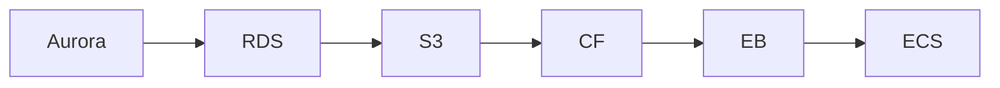

# InfraTales | AWS CDK Web App Deployment: VPC, Fargate, Aurora, and CloudFront Wired Together

**AWS CDK (TYPESCRIPT) reference architecture — networking pillar | advanced level**

> You need to deploy a production web application on AWS that handles variable traffic, stores user data securely, and serves static assets globally — but every tutorial gives you a single EC2 instance behind an ALB and calls it done. Real production means wiring VPC isolation, encrypted RDS, containerized workloads on Fargate, CDN caching, secret rotation, and multi-AZ failover into a single coherent CDK stack you can actually reason about under pressure. Getting any one of those layers wrong — open security groups, unencrypted RDS snapshots, NAT Gateway in every AZ — costs you either a security incident or a surprise $800 AWS bill.

[](LICENSE)
[](CONTRIBUTING.md)
[](https://aws.amazon.com/)
[-IaC-purple.svg)](https://aws.amazon.com/cdk/)
[](https://infratales.com/p/17674019-cea9-4369-98ad-66b66dbfd609/)
[](https://infratales.com)


## 📋 Table of Contents

- [Overview](#-overview)
- [Architecture](#-architecture)
- [Key Design Decisions](#-key-design-decisions)
- [Getting Started](#-getting-started)
- [Deployment](#-deployment)
- [Docs](#-docs)
- [Full Guide](#-full-guide-on-infratales)
- [License](#-license)

---

## 🎯 Overview

The stack builds a multi-tier AWS web application entirely in CDK TypeScript: a custom VPC with public, private, and isolated subnets feeds traffic through an ALB with ACM-terminated HTTPS to ECS Fargate tasks pulling images from ECR [from-code]. RDS Aurora sits in isolated subnets with KMS encryption and credentials vended through Secrets Manager [from-code], while S3 plus CloudFront handles static asset delivery with origin access control [from-code]. Auto Scaling adjusts Fargate task count based on ALB request metrics, and CloudWatch collects logs and alarms [from-code]. An EventBridge global endpoint with Route 53 health checks adds a cross-region failover hook that most production-ready CDK examples quietly omit [from-code]. The presence of EventBridge global endpoint health logic alongside a standard web app stack suggests the original team was building toward multi-region active-active rather than simple DR [inferred]. Embedding all of these tiers in a single CDK application means every dependency edge — VPC endpoint routes, KMS key policies, security group rules — is owned explicitly in code rather than configured ad hoc in the console [editorial].

**Pillar:** NETWORKING — part of the [InfraTales AWS Reference Architecture series](https://infratales.com).
**Target audience:** advanced cloud and DevOps engineers building production AWS infrastructure.

---

## 🏗️ Architecture



> 📐 See [`diagrams/`](diagrams/) for full architecture, sequence, and data flow diagrams.

> Architecture diagrams in [`diagrams/`](diagrams/) show the full service topology (architecture, sequence, and data flow).
> The [`docs/architecture.md`](docs/architecture.md) file covers component responsibilities and data flow.

---

## 🔑 Key Design Decisions

- NAT Gateway per AZ (recommended for HA) costs approximately $100/month per gateway in data processing fees alone [inferred from AWS public pricing]; a single shared NAT cuts cost but creates a hidden single point of failure for all private subnet egress [editorial].
- Aurora Serverless v2 would cut idle RDS cost to near zero for low-traffic periods, but the current provisioned Aurora cluster in this stack runs approximately $150-200/month minimum regardless of load [inferred from AWS RDS pricing for the instance class configured]; that trade-off is only justified if baseline traffic is consistently high enough to saturate a provisioned instance [editorial].
- CloudFront in front of S3 adds approximately $0.0085 per 10k HTTPS requests [inferred from AWS CloudFront public pricing] but eliminates S3 egress charges and provides edge caching [from-code via OAC configuration]; skipping CloudFront saves construct complexity but causes the S3 bill to scale linearly with traffic [editorial].
- Fargate removes EC2 patching overhead but costs 20-30% more per vCPU-hour than equivalent EC2 capacity [inferred from AWS Fargate vs EC2 public pricing]; at low task counts this premium is irrelevant, but at 50+ tasks running continuously it becomes a material cost conversation [editorial].
- The EventBridge global endpoint with Route 53 health check uses a CloudWatch alarm threshold of zero Invocations with treatMissingData set to NOT_BREACHING [from-code], meaning a completely idle event bus will never trigger failover — valid for consistently event-driven workloads but a silent coverage gap for low-volume applications [editorial].

> For the full reasoning behind each decision — cost models, alternatives considered, and what breaks at scale — see the **[Full Guide on InfraTales](https://infratales.com/p/17674019-cea9-4369-98ad-66b66dbfd609/)**.

---

## 🚀 Getting Started

### Prerequisites

```bash
node >= 18
npm >= 9
aws-cdk >= 2.x
AWS CLI configured with appropriate permissions
```

### Install

```bash
git clone https://github.com/InfraTales/<repo-name>.git
cd <repo-name>
npm install
```

### Bootstrap (first time per account/region)

```bash
cdk bootstrap aws://YOUR_ACCOUNT_ID/YOUR_REGION
```

---

## 📦 Deployment

```bash
# Review what will be created
cdk diff --context env=dev

# Deploy to dev
cdk deploy --context env=dev

# Deploy to production (requires broadening approval)
cdk deploy --context env=prod --require-approval broadening
```

> ⚠️ Always run `cdk diff` before deploying to production. Review all IAM and security group changes.

---

## 📂 Docs

| Document | Description |
|---|---|
| [Architecture](docs/architecture.md) | System design, component responsibilities, data flow |
| [Runbook](docs/runbook.md) | Operational runbook for on-call engineers |
| [Cost Model](docs/cost.md) | Cost breakdown by component and environment (₹) |
| [Security](docs/security.md) | Security controls, IAM boundaries, compliance notes |
| [Troubleshooting](docs/troubleshooting.md) | Common issues and fixes |

---

## 📖 Full Guide on InfraTales

This repo contains **sanitized reference code**. The full production guide covers:

- Complete AWS CDK (TYPESCRIPT) stack walkthrough with annotated code
- Step-by-step deployment sequence with validation checkpoints
- Edge cases and failure modes — what breaks in production and why
- Cost breakdown by component and environment
- Alternatives considered and the exact reasons they were ruled out
- Post-deploy validation checklist

**→ [Read the Full Production Guide on InfraTales](https://infratales.com/p/17674019-cea9-4369-98ad-66b66dbfd609/)**

---

## 🤝 Contributing

See [CONTRIBUTING.md](CONTRIBUTING.md) for guidelines. Issues and PRs welcome.

## 🔒 Security

See [SECURITY.md](SECURITY.md) for our security policy and how to report vulnerabilities responsibly.

## 📄 License

See [LICENSE](LICENSE) for terms. Source code is provided for reference and learning.

---

<p align="center">
  Built by <a href="https://infratales.com">InfraTales</a> — Production AWS Architecture for Engineers Who Build Real Systems
</p>
